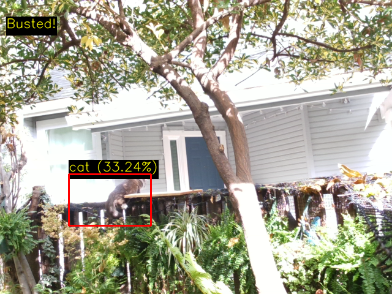

# KittyCam

Use an ever vigilant webcam to detect when my cat enters a forbidden region 
(like the top of the backyard fence). 

Can alert with a combination of:
* desktop notifications
* sounds
* text messages

Click on the screen to mark the vertices of the polygons. 

`<Esc>` clears all shapes.

`<Tab>` switches to/from low CPU-usage mode that samples fewer times per second and doesn't
display to the screen.
